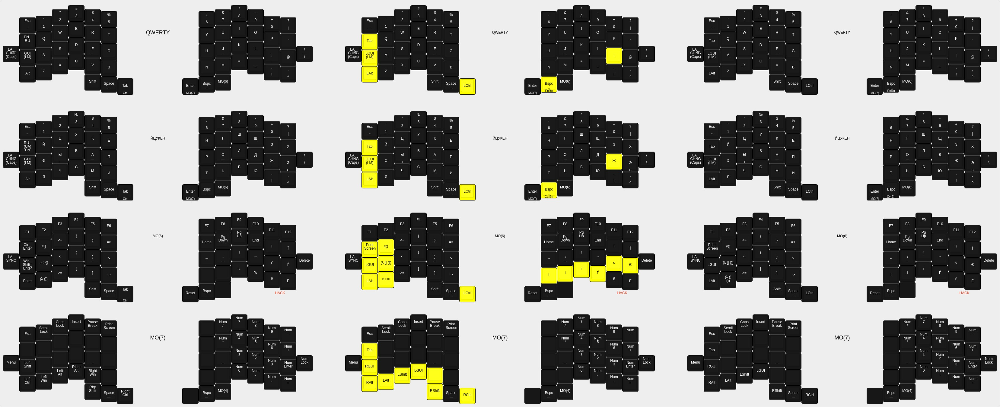
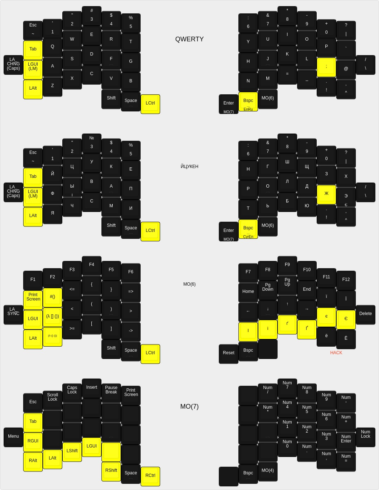

# kbdiff
Diff for keyboard-layout-editor.

## Installation

1. Clone the repo
2. ```git submodule update --init```
3. ```npm install```
4. ```npx shadow-cljs release kbdiff```
It will compile to kbdiff.js in out/ folder.

After this you can compile it to the executable binary using *caxa*:
```bash
npx caxa -i . -o kbdiff -- "{{caxa}}/node_modules/.bin/node" "{{caxa}}/out/kbdiff.js"
```

## Usage
```bash
node out/kbdiff.js (or ./kdbiff)
```

### --help :
```
  -1, --version1 path                    Path to the json layout file of the version 1
  -2, --version2 path                    Path to the json layout file of the version 2
  -d, --dest path         kle-diff.json  Path to the resulting diff file
  -c, --color value       #ffff00        HEX value of the color for the changed key on diff
  -t, --text-color value  #000000        HEX value of the color for the text of changed key on diff
  -i, --include-layouts                  Whether to include initial layouts in the diff
  -a, --axis value        x              On which axis to stack layouts
  -g, --gap value         3              Gap between stacked layouts
  -h, --help
```

## Example
```bash
node out/kbdiff.js -1 resources/jiran_old.json -2 resources/jiran_new.json -d resources/jiran_diff.json -i -g 3 -a x
```
Outputs *resources/jiran_diff.json* of two random versions of my Jiran layout (**with -i flag**) that looks like this:


No included version (**without -i flag**):

